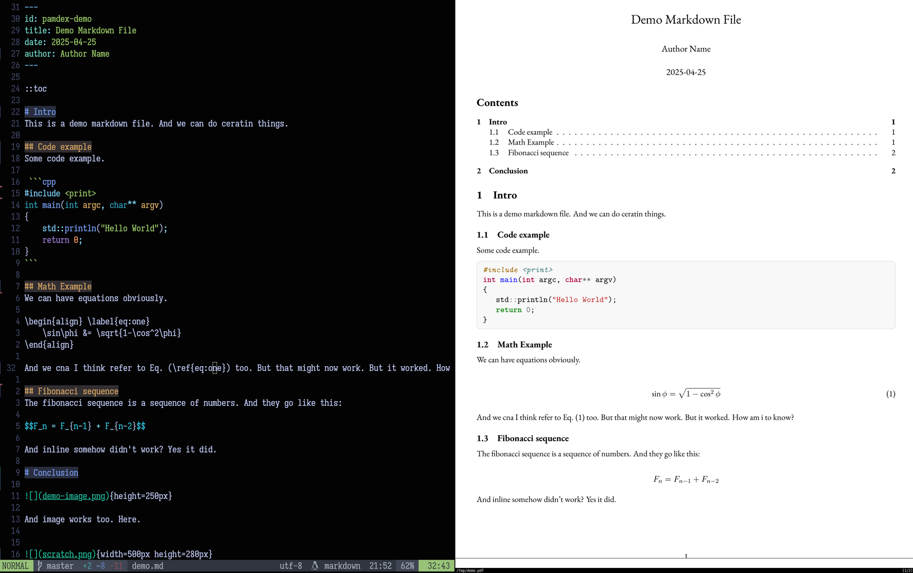

# pamdex.nvim



A super handy Neovim plugin for converting Markdown to PDF with near real-time visualization!

This plugin leverages Pandoc to generate beautiful PDFs from your Markdown documents, offering a seamless workflow directly within Neovim. Configure your Pandoc path and template to customize your output.

## ✨ Features

* **Effortless Markdown to PDF Conversion:** Convert your Markdown files to PDF with a simple command.
* **Near Real-time Visualization:** While not a live preview in the traditional sense, the plugin is designed for quick and iterative conversion, allowing you to see the PDF output rapidly as you edit your Markdown.
* **Customizable Pandoc:** Configure the path to your Pandoc installation.
* **Template Support:** Specify a Pandoc LaTeX template for fine-grained control over the PDF's appearance.

## 📦 Installation

This plugin is designed to be used with a plugin manager for Neovim. Here's how to install it using [Lazy](https://github.com/folke/lazy.nvim):

Add the following to your `plugins` specification in your Neovim configuration (e.g., `init.lua` or a dedicated plugins file):

```lua
{ "pranphy/pamdex.nvim" }
```

Then, run `:Lazy sync` in Neovim to install the plugin.

## ⚙️ Configuration

You can configure `pamdex.nvim` by calling the `setup` function. It accepts a table with the following optional parameters:

```lua
require("pamdex").setup({
  pandoc = "/path/to/pandoc", -- Default: "pandoc" (assumed to be in your system's PATH)
  template = "latex",       -- Default: "latex" (Pandoc's built-in LaTeX template)
  pdf_engine = "lualatex", -- pdf engine for pandoc to use
  pdf_viewer = "zathura",  -- pdf viewer to use
  lua_filter = "minted.lua", -- Default: "minted.lua"
  citeproc = true,         -- Default: true
  meta_yaml = "meta.yaml", -- Default: "meta.yaml"
  pdf_engine_opts = { "--shell-escape" }, -- Default: { "--shell-escape" }
  transforms = { { "from", "to" } }, -- Replaces Lua string matching pattern `from` to `to` in Markdown content
})
```

  * **`pandoc`**: Specifies the full path to your Pandoc executable if it's not in your system's PATH.
  * **`template`**: Sets the Pandoc template to be used for PDF generation. You can specify the name of a built-in Pandoc template (e.g., "latex", "default") or the path to a custom `.latex` template file.
  * **`lua_filter`**: Specifies a lua filter script for Pandoc to pass via `--lua-filter`. Set to an empty string or `nil` to disable.
  * **`citeproc`**: Boolean to toggle Pandoc's `--citeproc` functionality.
  * **`meta_yaml`**: Filename of the metadata yaml file to parse from the directory. Set to an empty string or `nil` to disable.
  * **`pdf_engine_opts`**: A list of additional string arguments to pass to the `--pdf-engine-opt` flag.
  * **`transforms`**: A list of pairs `{"pattern", "replacement"}`. These are passed directly to Lua's `string.gsub` function to pre-process the Markdown content before compiling.

**Example Configuration:**

To use a custom Pandoc path and a specific LaTeX template, you might configure the plugin like this:

```lua
require("pamdex").setup({
  pandoc = "/usr/local/bin/pandoc",
  template = "~/.config/pandoc/my_custom_template.latex",
})
```

## Suggested Mapping

```lua
local pmd = require("pamdex")
vim.keymap.set("n","<Leader>pm",pmd.compile_start)
vim.keymap.set("n","<Leader>pv",pmd.open_it)
```

## 🚀 Usage

Once the plugin is installed and (optionally) configured, you can convert the currently open Markdown file to PDF using the following Neovim command:

* **`<Leader>pm`**: This mapping will save your current Markdown file and then run Pandoc in the background to convert it to a PDF in the same directory. The output PDF will have the same base name as your Markdown file but with the `.pdf` extension.

* **`<Leader>pv`**: This mapping will open the compiled PDF (assuming it exists in the same directory as the current Markdown file) using your system's default PDF viewer.


This command will:

1.  Save your current Markdown file.
2.  Run Pandoc in the background to convert the Markdown file to a PDF in the same directory as the Markdown file. The output PDF will have the same base name as your Markdown file but with the `.pdf` extension.
3.  (Potentially, depending on your system and configuration) Open the generated PDF using your default PDF viewer.

**Near Real-time Visualization:**

The speed of the conversion depends on the complexity of your Markdown document and the chosen template. However, `pamdex.nvim` is designed to be quick, allowing you to rapidly iterate on your document and generate updated PDFs as you make changes. Simply save your Markdown file and it will be autocompiled.

Choose a pdf viewer that will detect file change and update the view for example `zathura`.

## 🤝 Contributing

Contributions, bug reports, and feature requests are welcome\! Please feel free to open an issue or submit a pull request on the [GitHub repository](https://github.com/pranphy/pamdex.nvim).
